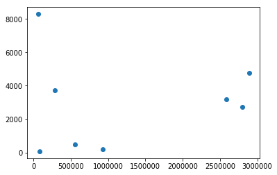
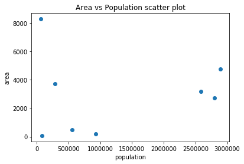
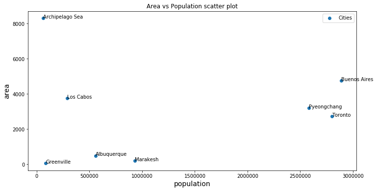
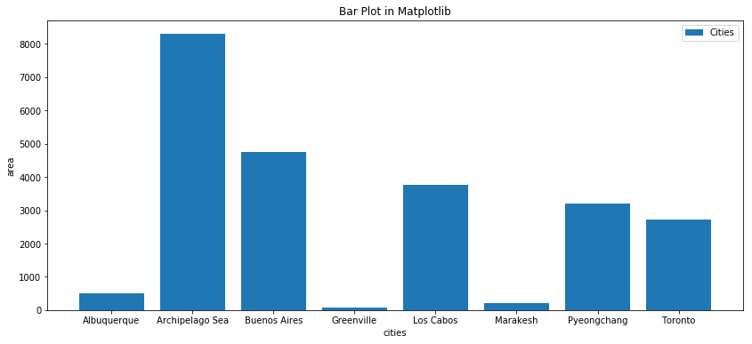
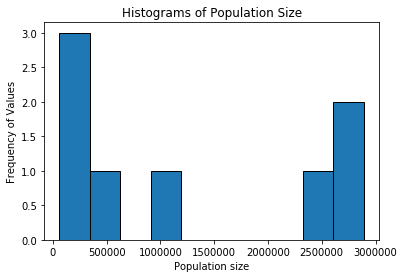
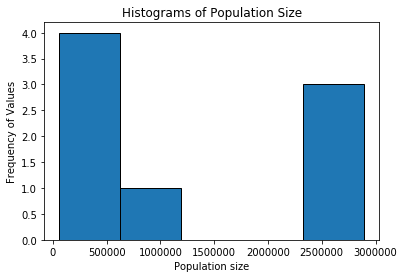

# Data Visualization

## Introduction

This lesson introduces data visualization using Python and the popular Matplotlib plotting library. You will explore the fundamental features of standard Matplotlib plots and how to use them for creating and customizing visualizations. 

## Objectives
You will be able to:
* Use Matplotlib to create a scatter plot
* Use Matplotlb to create a bar plot
* Use Matplotlib to create a histogram

## Matplotlib Plotting Library

The Matplotlib plotting library provides a range of built in functions to start visualizing data with minimal effort. Recall that a _library_ is a collection of code that allows you to perform many actions without having to write a ton of lines of code that does not come with Python.

First, import `matplotlib`'s `pyplot` library. You don't fully have to understand this code right now, just remember that you need to run this line to introduce P You will see that importing the `pyplot` module from Matplotlib provides simple and agile creation of plots. 

```python
import matplotlib.pyplot as plt

```

In Jupyter notebooks, you can use the `%matplotlib` "magic command" with `inline` to show plots inside the notebook or `qt` for external plots. The `inline` option is recommended for most requirements (external plots are suitable for interactive visualizations).  


```python
# Import matplotlib
import matplotlib.pyplot as plt

# Set plot space as inline for inline plots and qt for external plots
%matplotlib inline
```

## Scatter Plots

A scatter plot is a two-dimensional data visualization that uses individual data points to represent the values obtained for two different variables - one plotted along the x-axis and the other plotted along the y-axis. 

Scatter plots are used when you want to show the relationship between two variables. Scatter plots are sometimes called correlation plots because they show how two variables are related. 

Let's show how you can create scatter plots using our cities, population and areas lists and the `matplotlib` library.


```python
cities = ["Buenos Aires", "Toronto", "Pyeongchang", "Marakesh", 
          "Albuquerque", "Los Cabos", "Greenville", "Archipelago Sea"]

populations = [2891000, 2800000, 2581000, 928850, 559277, 287651, 84554, 60000] 

areas = [4758, 2731, 3194, 200, 491, 3750, 68, 8300]
```

Now that you have your data ready, we'll create a scatter plot using the `plt.scatter()` function which takes in two lists `populations` and `areas` to shows their relationship. 


```python
# Pass in populations and areas in plt.scatter()

plt.scatter(populations, areas)

plt.show()
```





Nice, that worked! Each dot on this plot represents one city, and shows their population size on the x-axis, and the area size on the y-axis. The plot looks good, but is pretty meaningless if you were to present this to someone who doesn't know about the context. It would be nice to label the x-axis and the y-axis in the plot. Additionally, it would be nice to give a title to the plot. 

You can use 
`plt.title()` 
`plt.xlabel()`, and
`plt.ylabel()` 
to do so. Let's have a look.


```python
# Pass in populations and areas in plt.scatter()

plt.scatter(populations, areas) 

plt.title('Area vs Population scatter plot')

plt.xlabel('population')
plt.ylabel('area')

plt.show()
```





Now, let's take it even a little bit further by adding a legend, making the image bigger, and adding labels to the dots in the scatter plot.

- To add a label, you can specify an argument "label" inside the `plt.scatter()`-function, using a string along with a separate line of code `plt.legend()`.
- To change the image size, use `plt.figure(figsize=(a,b))`, where a and b specify the width and height of the plot in inches.
- To add labels to your dots, you can use a **for loop**! You just learned about this in your last lesson and lab, and for loops already prove useful! This is definitely more advanced use of for loops (and of creating images), bur you can have a look at how it's done in the image below.


```python
# Pass in populations and areas in plt.scatter()

plt.figure(figsize=(12,6))
plt.scatter(populations, areas, label = "Cities" )

plt.title('Area vs Population scatter plot', size = 12)
plt.legend()

plt.xlabel('population', size = 14) # we also changed the size of the axis labels!
plt.ylabel('area', size = 14)       # we also changed the size of the axis labels!

for i, city in enumerate(cities):
    plt.annotate(city, (populations[i], areas[i]))
    
plt.show()
```





## Bar Graphs

Bar graphs (also called "bar charts") are one of the most common plot types for showing comparisons across data. Bar graphs allow comparisons across categories by presenting categorical data as rectangular bars with heights or lengths proportional to the values that they represent. One axis of the graph shows the specific categories being compared and the other axis represents a value scale. The bars can be plotted vertically or horizontally. When the bars are plotted vertically, it is usually referred to as a "column graph." Some examples of bar graphs are shown below.


Matplotlib features a number of handy plotting functions. Matplotlib's `.bar()` and `.barh()` functions can be used to draw constant width vertical and constant height horizontal bar graphs for a simple sequence of x, y values. 

Now, plot a bar graph using the `cities` list along with the `areas` list


```python
# Use the bar() function to create a plot using the above values of x and y. Add a legend.

plt.figure(figsize=(14,6))

plt.bar(cities, areas, label='Cities')

plt.xlabel('cities')
plt.ylabel('area')

plt.title('Bar Plot in Matplotlib')
plt.legend()

plt.show()
```





That bar graph above is useful because you can easily compare area sizes for each city - which is especially useful as data grows!

##  Histograms 

A histogram is a plot that lets you discover the underlying frequency distribution of a data set. It allows you to visualize fundamental properties about the data like if it is skewed in any particular direction or if it has outliers. An example of a histogram of the ages of people is shown below:


Basically, histograms are used to represent data that has been split into some number of groups. The x-axis describes the groups and the y-axis describes the frequency of occurrence. If this is a little confusing, consider the histogram of ages above. The x-axis shows ages in groups of 10 years. The y-axis is a count of how many times a member from each group appears in the data. For example, there are 2 occurrences of ages between 20-30.

It is important to distinguish bar graphs from histograms. Bar graphs show category-specific values and consist of two variables. Histograms show counts of how frequently a given range of values occurs in a data set. Take a look at the examples below and think about how they are different: 

<br>

<br>

You can use the `plt.hist()` function in matplotlib to draw a histogram while passing in values from the required data variable. Say you want to plot a histogram of the retirement ages of 200 people. You can use ```plt.hist()``` to do this:


```python
#Plot the population histogram with hist() function

plt.hist(populations, bins = 10, edgecolor= 'black')

plt.xlabel('Population size')
plt.ylabel('Frequency of Values')
plt.title('Histograms of Population Size')
plt.show()
```





Recall, the y-axis tells you how often a certain range of numbers appears in the data set. From the histogram, you can see that in our small list of 8 city population sizes, there are a 3 smaller cities (size < 300,000), and a 2 really big cities (> 2,600,000). Note that histograms really become useful when you have more than 8 data points. 

### The `bins` Argument
Say you want to change the range of values that define the groups of a histogram. You can optionally pass the `bins` argument to set the number of groups. In the plot above, the data have been separated into 10 groups. Check out what happens when you change the number of bins to 5:


```python
plt.hist(populations, bins=5, edgecolor='black')
plt.xlabel('Population size')
plt.ylabel('Frequency of Values')
plt.title('Histograms of Population Size')
plt.show()
```





Note the scale of the y-axis and the width of the bars compared to the histogram using 10 bins. The granularity of the bins can be changed according to your specific analytical needs and the amount of data available. For example, if you had 50 data points, you would probably not want to use 500 bins. Just like we shouldn't really have used 10 bins with 8 data points. Remember, histograms will become more useful as the data gets bigger!

## Summary

In this lesson, you learned how to use Matplotlib's basic plotting techniques to visually describe your data as scatter plots, bar graphs, and histograms. You also identified use cases for each of these techniques and learned how to customize and add basic details to a plot. 
